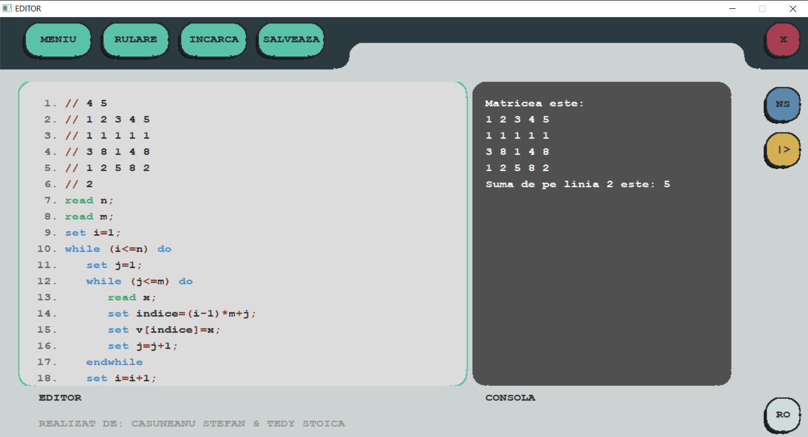
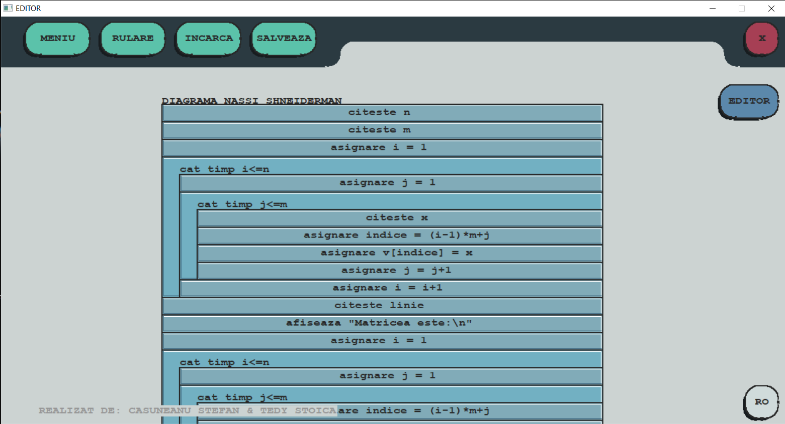
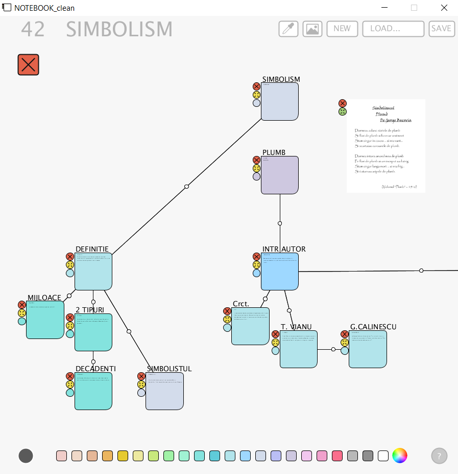
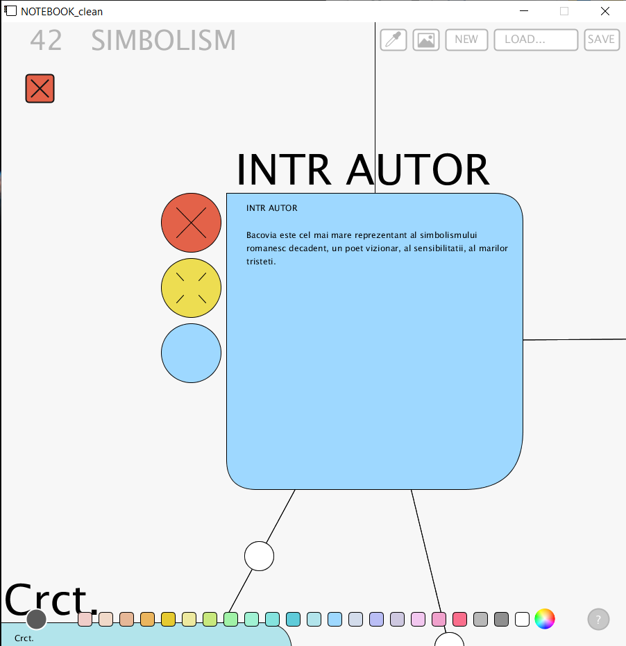
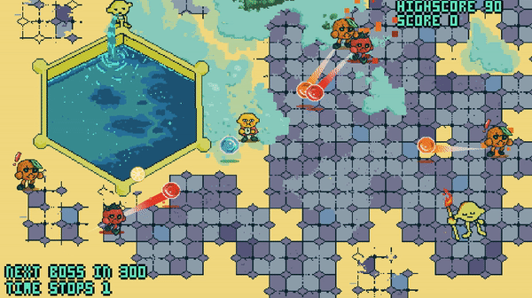
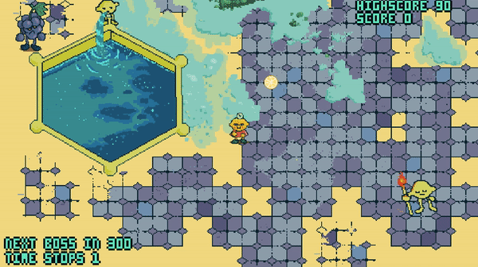
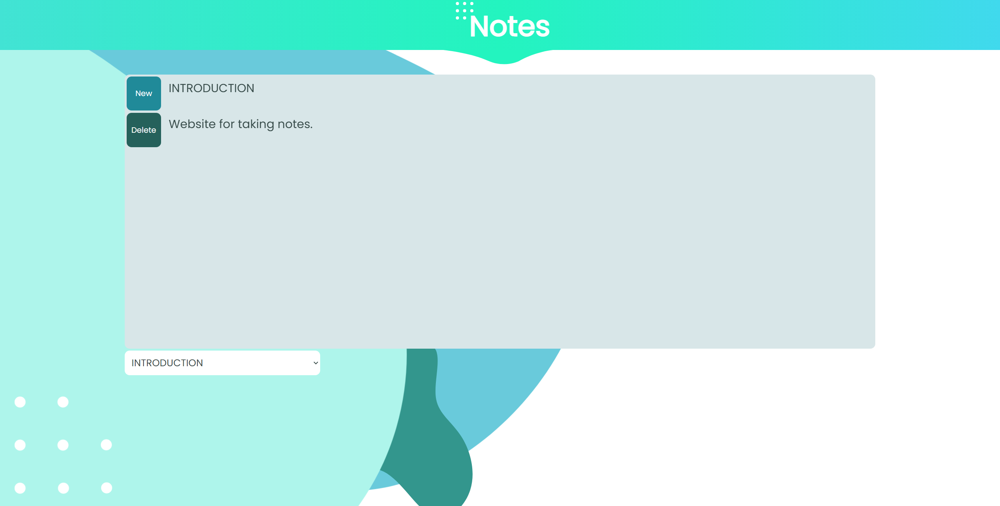
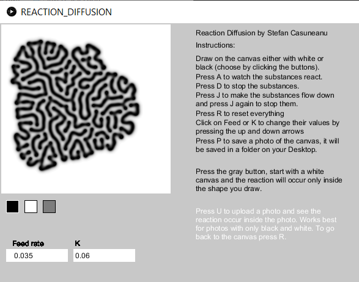

# PROJECTS
Some other projects of mine:

### Nassi Shneiderman App made in c++ with a colleague
It has a code editor, wich it also runs and shows the diagram for it.

### Note taking app made in processing to help me prepare for the final exam in highschool.
It has infinite space to move freely in ( think Figma ), you can create notes and make connections between them, add photos, save the notes etc.

### Lemon Boy - A game i made, all the art is also made by me.

### Note taking website

### Reaction Diffusion app

